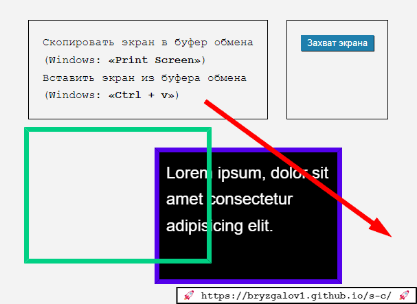

# screen-capture

# `Простой инструмент сделать и поделиться скриншотом`.

## `Сервис обмена скриншотами Screenshot sharing service`

 

1. Универсальный инструмент доступный из браузера.
1. Возмоность сделать скриншот с помощью опереционной системы или захватить экран с помощью "Screen Capture API".
1. Возмоность кадрировать и редактировать скриншот.
1. Возможность делиться отредактированным скриншотом через буфер обмена или сохраняя как файл.

## `App`

[https://bryzgalov1.github.io/s-c/](https://bryzgalov1.github.io/s-c/)

